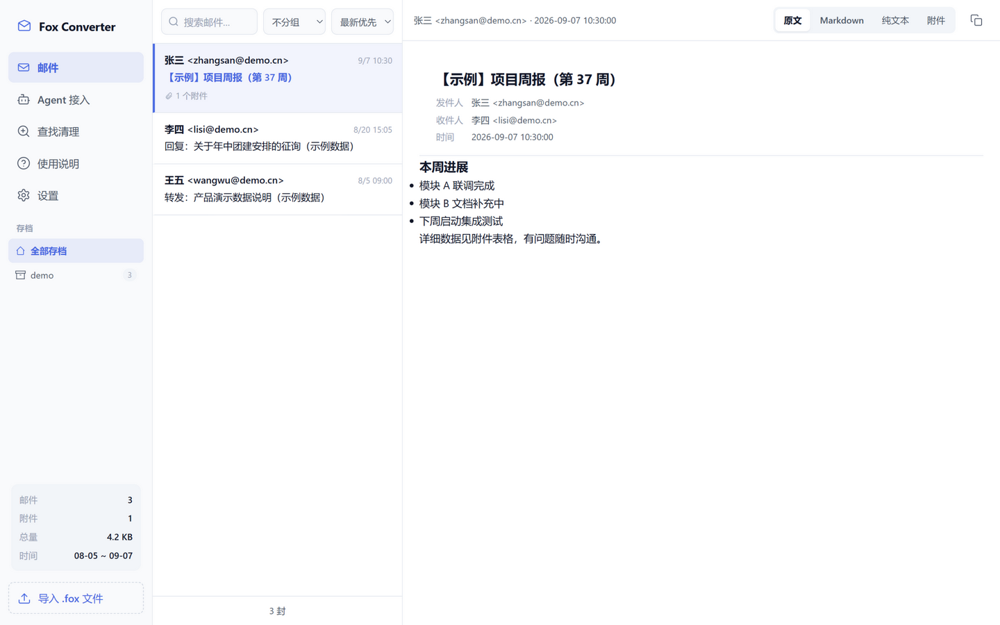

# Fox Converter

[](LICENSE)
[](https://github.com/wb2951516-collab/fox-converter/releases)
[](https://github.com/wb2951516-collab/fox-converter/releases)

**把 Foxmail 的 .fox 存档直接变成可阅读、可搜索、可喂给 AI 的 Markdown。**

不装 Foxmail、不手动导出——拖入 .fox 文件，得到带全文搜索的本地阅读界面，外加结构化的 Markdown / 纯文本 / 附件目录，方便接入 RAG 知识库。

[English](#english) | 中文



## 它解决什么问题

Foxmail 的「邮件存档」功能生成的 .fox 文件是个封闭格式：换电脑、清邮箱之前想把自己多年的邮件完整备份成通用格式，官方没有给出路。市面上的商业转换器按封收费、还要上传邮件。

Fox Converter 在本地把 .fox 拆开——里面其实是标准的邮件数据——转成 Markdown + 纯文本 + 附件目录，并附带一个本地阅读界面和全文搜索。

## 功能

- **一键导入**：支持选择多个 .fox 文件或整个文件夹，批量转换带双层进度
- **本地阅读界面**：邮件列表（中文全文搜索 / 按主题-发件人-收件人分组）+ 三种正文视图（原文 / Markdown / 纯文本）+ 附件独立下载
- **结构化导出**：`markdown/`（YAML front matter）+ `plaintext/`（含邮件头摘要的 txt）+ `attachments/`，`manifest.json` 索引全部邮件——直接对接 openclaw / WinClaw 等 AI 工具的 RAG 流程
- **存档管理**：已导入存档独立管理，跨存档 Message-ID 去重，按存档删除
- **存储位置自定义**：数据库与导出文件可放到任意磁盘，支持在线迁移
- **查找清理**：按发件人 / 主题 / 日期区间 / 大小筛选，双模式删除（连文件删除 / 仅移出索引）
- **Agent 接入**：内置技能生成器，智能体（WinClaw / Claude 等）复制提示词即可接入，读取邮件内容
- **细节**：深浅色主题、GBK/GB18030/UTF-8/UTF-16 编码容错、单实例、应用窗口居中

## 快速开始

1. 从 [Releases](https://github.com/wb2951516-collab/fox-converter/releases) 下载 `FoxConverter_Setup.exe` 安装（无需管理员权限）
2. 首次打开：按引导把存储位置设到空间够的盘（不设置无法导入）
3. 点「导入 .fox 文件」，选择存档，等待转换完成
4. 开始阅读、搜索，或把导出目录接入你的 AI 工具

想先看看效果？仓库自带 [examples/demo.fox](examples/demo.fox)（3 封虚构邮件），导入它即可体验完整流程。

## 从源码运行

```bash
pip install -r requirements.txt
python run.py
```

批量转换：

```bash
python -m foxmail2md 存档.fox -o ./output              # 全量
python -m foxmail2md 存档.fox -o ./output --incremental # 增量（去重）
```

## 导出结构（给 RAG 的建议）

```
导出目录/
├── manifest.json          # 全部邮件的元数据索引
├── *.md                   # Markdown 区（YAML front matter）
├── plaintext/*.txt        # 纯文本区（含邮件头摘要）
└── attachments/<hash>/    # 附件原文件
```

`plaintext/` 喂 embedding，`manifest.json` 里的 subject / from / date 做结构化过滤，`attachments/` 里的 Office/PDF 按需单独解析。

## 工作原理

.fox 是 Foxmail 的专有容器。经分析：文件头为 `ARCF` 魔数，之后每封邮件以 16 字节定界符开始，内容是未加密的标准 RFC 822 MIME。本工具据此流式切分（mmap + 魔数定位），逐封交给 Python 标准库解析。细节见 [docs/fox-format.md](docs/fox-format.md)。

## Agent 接入

「Agent 接入」页一键复制提示词和 API Key 发给你的智能体，装好技能后直接对话：

> "帮我找一下九月关于项目验收的邮件，总结要点。"

技能兼容 AgentSkills 规范（openclaw / WinClaw / Claude 等），走本地 HTTP API，数据不出你的电脑。

## 兼容性

在 1.18 GB / 1108 封真实存档上验证：解析成功率 100%，附件（含中文名、内嵌图）完整还原，乱码率 0.09%。已适配 GBK / GB2312 / UTF-8 / UTF-16 及 Outlook 系邮件的怪癖。

## 参与贡献

Issue、PR 都欢迎。修 bug 请附带日志（`%APPDATA%\foxmail2md\logs\app.log`，注意脱敏）。

## 许可与声明

本项目基于 [GPL-3.0](LICENSE) 开源。

- 本项目与腾讯 / Foxmail 官方无关，仅为个人数据互操作工具
- .fox 格式信息来自对自有存档的逆向分析，仅用于读取你自己拥有的数据
- 请勿用于处理不属于你或无权处理的邮件数据；使用本项目产生的任何后果由使用者自行承担

---

<a name="english"></a>
## English

**Convert Foxmail .fox archives into readable, searchable, AI-ready Markdown — locally.**

Foxmail's archive feature (.fox files) is a closed format with no official export path. Fox Converter unpacks it on your machine (the contents are plain RFC 822 MIME behind a thin container), renders a local reading UI with full-text search, and exports structured Markdown / plain text / attachments for RAG pipelines.

### Features

- Batch import of .fox files (multi-select or whole folders) with dual-level progress
- Local web UI: mail list (Chinese full-text search, thread grouping by subject/sender/recipient), original HTML / Markdown / plain-text views, per-mail attachment downloads
- Structured export: `markdown/` + `plaintext/` + `attachments/` + `manifest.json` — ready for openclaw / WinClaw / Claude RAG workflows
- Archive management with cross-archive Message-ID dedup, per-archive deletion
- Relocatable data & export directories with online migration
- Conditional find & cleanup with two delete modes (index-only / full wipe)
- Built-in agent skill generator (API key auth, AgentSkills-compatible)

### Quick start

Download `FoxConverter_Setup.exe` from [Releases](https://github.com/wb2951516-collab/fox-converter/releases), install (no admin required), point the storage location to a roomy drive, and import your `.fox` archives. A sample archive ([examples/demo.fox](examples/demo.fox), 3 fictional emails) is included for a quick tour.

### How it works

The .fox container starts with an `ARCF` magic; each message is prefixed by a 16-byte delimiter followed by plain RFC 822 MIME. The tool memory-maps the file, carves messages by delimiter, and parses them with Python's standard library. See [docs/fox-format.md](docs/fox-format.md).

### License & disclaimer

GPL-3.0. Not affiliated with Tencent / Foxmail. Format notes come from analyzing my own archives and are provided for personal data interoperability only — use it on data you own.
